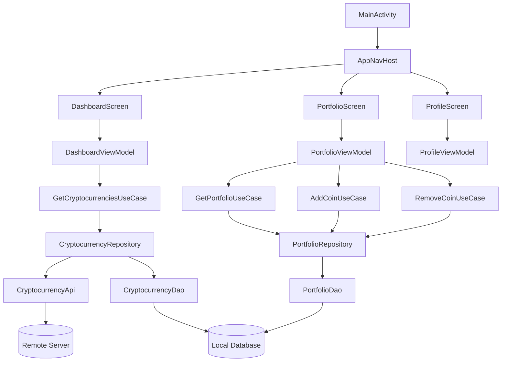
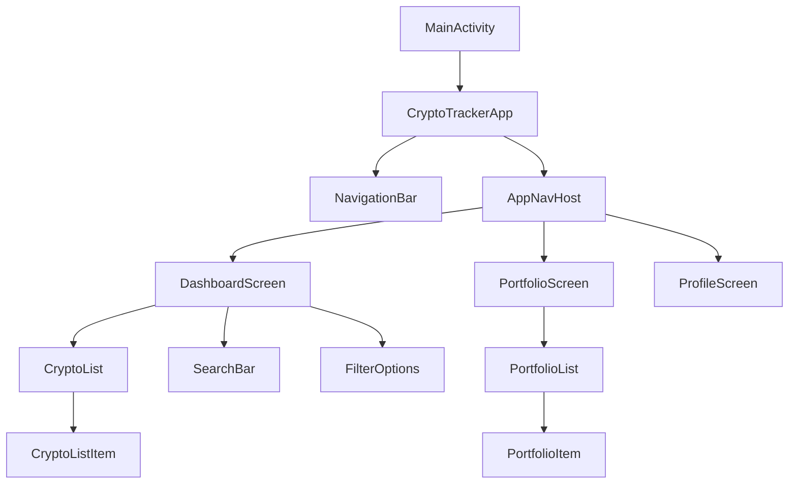
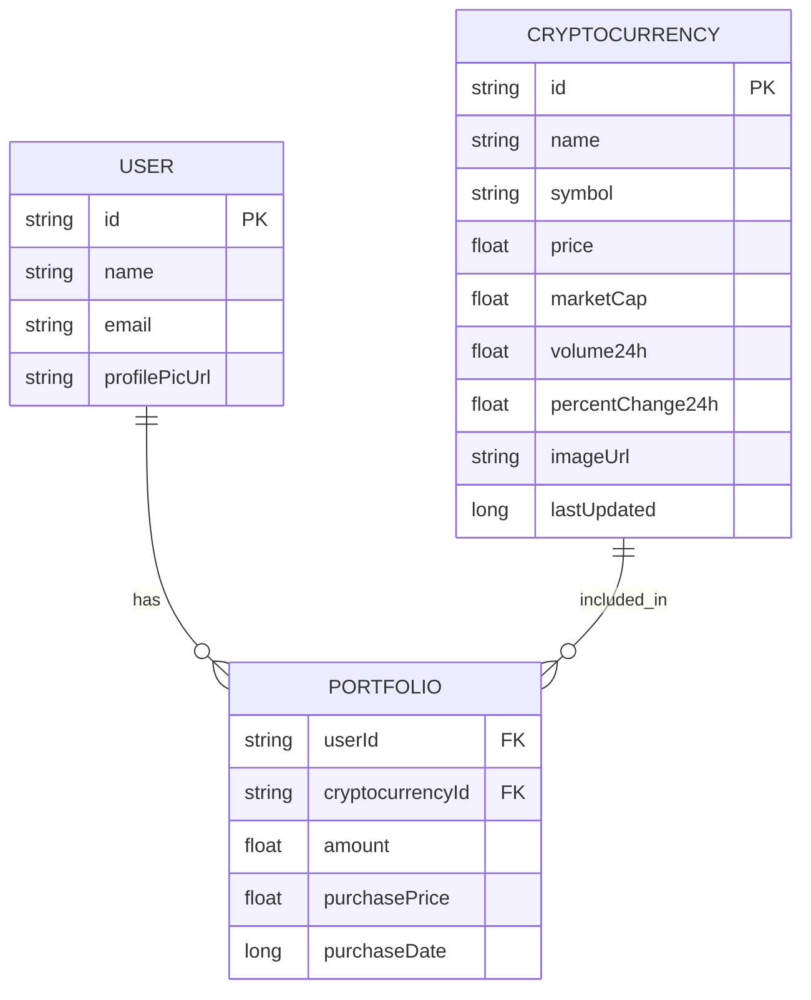
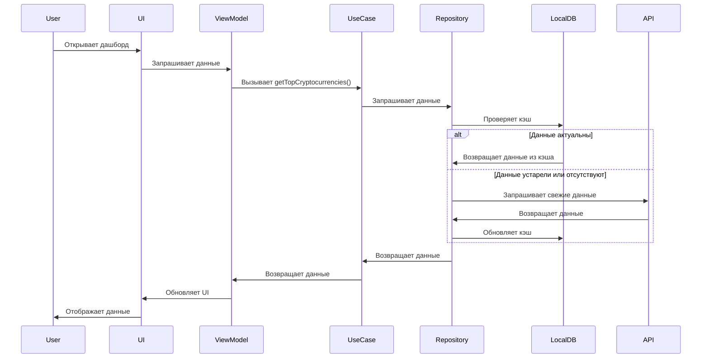
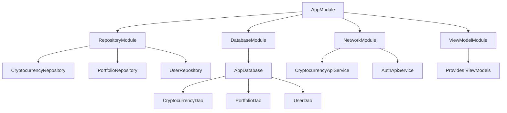

# Диаграмма файлов приложения

## Общая архитектурная структура

Приложение разработано с использованием принципов Clean Architecture, что позволяет обеспечить четкое разделение ответственности и повысить тестируемость кода.

```
     UI (Presentation Layer)
     ↑        ↓
     ↑    ViewModel
     ↑        ↓
 Domain Layer (Use Cases)
     ↑        ↓
     ↑   Repositories
     ↑        ↓
   Data Layer (API + DB)
```

## Взаимодействие основных компонентов



## Диаграмма структуры UI компонентов



## Диаграмма базы данных



## Диаграмма потока данных



## Модель внедрения зависимостей

