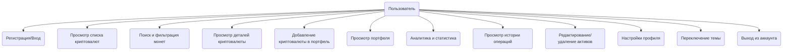

# Функциональные требования

## Диаграмма вариантов использования

## Основные функции

### 1. Просмотр информации о криптовалютах
- Отображение списка популярных криптовалют
- Просмотр детальной информации о каждой криптовалюте
- Поиск криптовалют по названию или символу
- Отображение графиков изменения курса

### 2. Управление портфелем криптовалют
- Добавление криптовалюты в портфель
- Указание количества и цены покупки
- Отслеживание текущей стоимости портфеля
- Анализ прибыли/убытков
- Удаление валюты из портфеля

### 3. Аналитика и статистика
- Отображение графиков и диаграмм изменения стоимости криптовалют
- Статистика по портфелю пользователя:
    - Общая стоимость портфеля
    - Общая прибыль/убыток в абсолютных и процентных значениях
    - История операций (покупки/продажи) 
- Визуализация ключевых показателей (KPI) на главном экране:
    - Текущий баланс
    - Количество активов
    - Совершённые сделки

## Нефункциональные требования

- **Кроссплатформенность:** Приложение должно корректно работать на устройствах с Android 10 и выше.
- **Производительность:** Время отклика интерфейса не должно превышать 200 мс при стандартных сценариях использования.
- **Безопасность:** 
    - Данные пользователя должны храниться локально и не передаваться третьим лицам.
    - Использование безопасных методов хранения данных (Room, EncryptedSharedPreferences при необходимости).
- **Надёжность:** 
    - Приложение должно корректно обрабатывать ошибки сети и отображать соответствующие сообщения пользователю.
    - Все критические операции должны сопровождаться подтверждением пользователя (например, удаление валюты из портфеля).
- **Тестируемость:** 
    - Код должен быть покрыт модульными и UI-тестами.
    - Использование мок-объектов для тестирования бизнес-логики.
- **Масштабируемость:** Архитектура приложения должна позволять легко добавлять новые функции и интеграции.
- **Удобство использования:** 
    - Интерфейс должен быть интуитивно понятным и соответствовать гайдлайнам Material Design.
    - Поддержка светлой и тёмной темы.
- **Локализация:** Приложение должно поддерживать как минимум русский и английский языки.
- **Документированность:** 
    - Исходный код должен сопровождаться комментариями.
    - В проекте должна быть актуальная документация для разработчиков и пользователей.