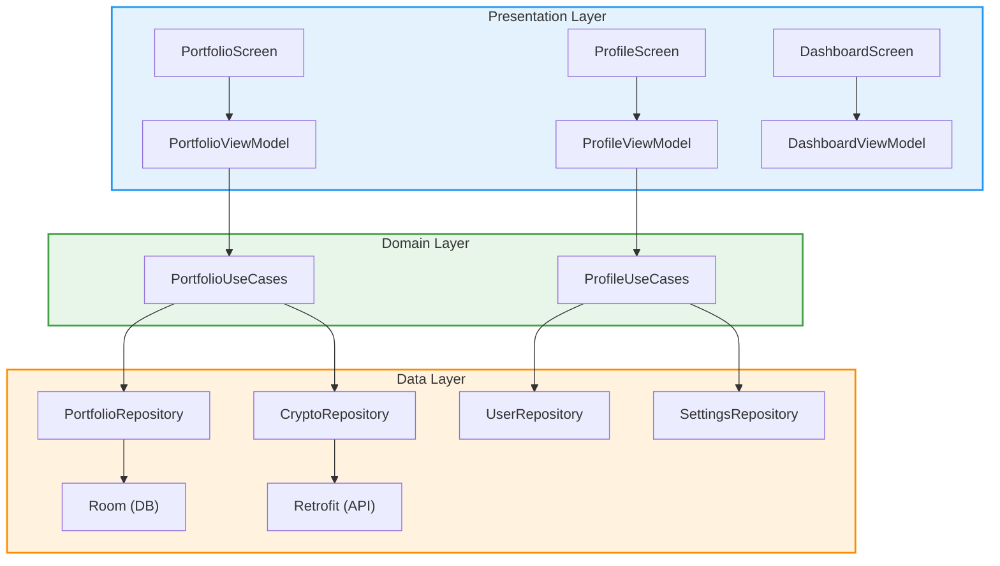
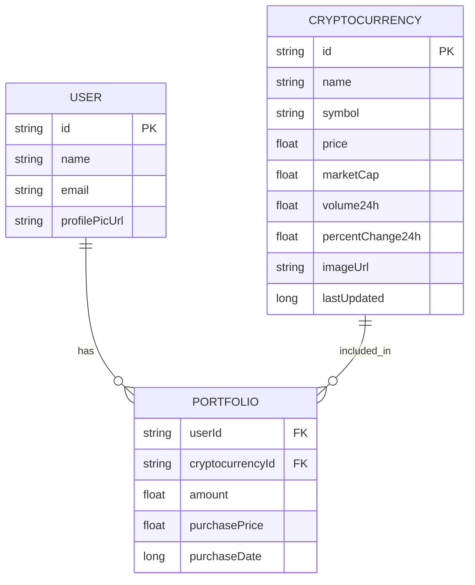
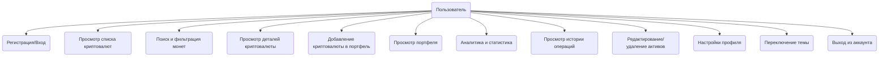
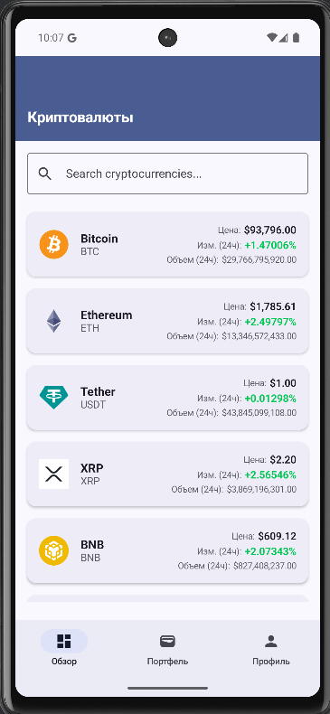
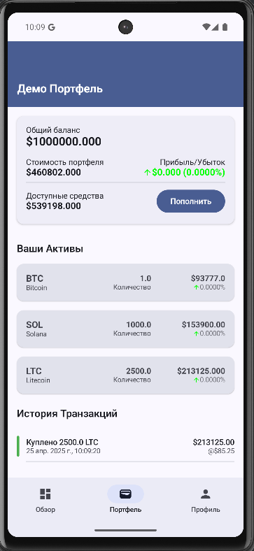
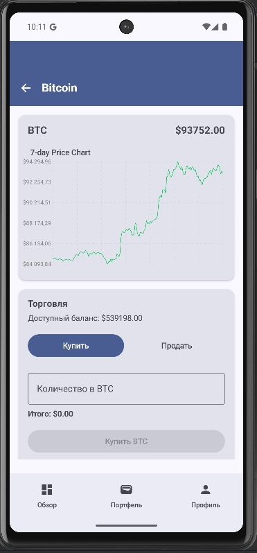
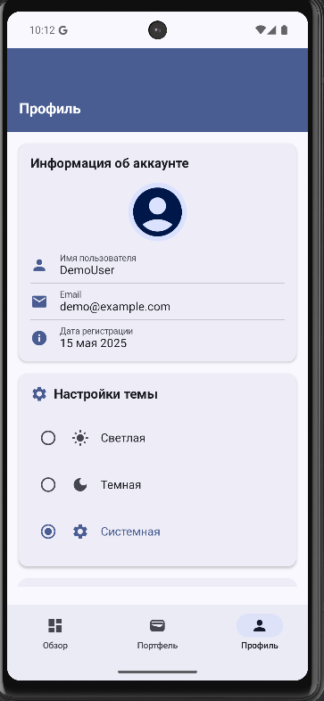

# Презентация проекта MockCrypto

## Обзор проекта

MockCrypto — это современное Android-приложение для отслеживания и управления инвестициями в криптовалюты. Приложение позволяет пользователю:
- Просматривать актуальную информацию о популярных криптовалютах
- Управлять собственным портфелем (добавлять, удалять, анализировать активы)
- Получать аналитику и статистику по своим инвестициям
- Использовать удобный и интуитивный интерфейс, выполненный в стиле Material Design

MockCrypto реализует лучшие практики архитектуры (MVVM, Clean Architecture), что обеспечивает масштабируемость, тестируемость и высокую производительность.

## Ключевые функции

- Просмотр списка криптовалют с актуальными ценами и графиками
- Детальная информация о каждой монете
- Поиск и фильтрация криптовалют
- Управление портфелем: добавление, редактирование, удаление активов
- Аналитика: прибыль/убыток, динамика портфеля, KPI
- История операций (покупки/продажи)
- Профиль пользователя и настройки
- Поддержка светлой и тёмной темы, локализация (RU/EN)

## Архитектура приложения

Приложение построено по принципам Clean Architecture и MVVM:

## Структура данных (ER-диаграмма)

## Основные пользовательские сценарии

1. **Регистрация/авторизация**
2. **Просмотр дашборда с топовыми криптовалютами**
3. **Поиск и фильтрация монет**
4. **Добавление криптовалюты в портфель**
5. **Просмотр и анализ портфеля**
6. **Просмотр истории операций**
7. **Настройка профиля**

## Диаграмма вариантов использования

## Демонстрация работы (макет)

1. **Запуск приложения** — переход к экрану входа/регистрации
2. **Вход пользователя** — регистрация/логин
3. **Дашборд** — показ списка криптовалют, поиск, фильтрация, просмотр графиков
- [Дашборд](https://github.com/fpmi-pmvs2025/pmvs12b-lab8-dream_team_ye/blob/main/screenshots/main_screen.png)
4. **Детальный экран монеты** — просмотр информации, графика, добавление в портфель
- [Детали криптовалюты](../screenshots/crypto_detail_screen.png)
5. **Портфель** — отображение активов, аналитика, прибыль/убыток, удаление/редактирование
- [Портфель](../screenshots/portfolio_screen.png)
6. **История операций** — просмотр всех совершённых сделок
- [История транзакций](../screenshots/transactions.png)
7. **Профиль** — смена данных, переключение темы, выход из аккаунта
- [Профиль пользователя](../screenshots/profile_screen.png)

## Технологический стек

- **Kotlin** - основной язык программирования
- **Jetpack Compose** - современный инструментарий для создания пользовательского интерфейса
- **Material 3** - дизайн-компоненты нового поколения
- **MVVM** - архитектурный паттерн
- **Clean Architecture** - принципы организации кода
- **Room** - для локального хранения данных
- **Retrofit** - для работы с сетевыми запросами
- **OkHttp** - низкоуровневый HTTP-клиент
- **Gson** - сериализация/десериализация JSON
- **Kotlin Coroutines** - асинхронное и конкурентное программирование
- **Navigation Compose** - навигация между экранами
- **Coil** - загрузка и отображение изображений
- **JUnit** - модульное тестирование
- **Mockito** - мок-объекты для unit-тестов
- **Espresso** и **Compose UI Test** - инструментальные и UI-тесты
- **Service Locator** - ручная реализация DI (Dependency Injection)
- **ViewModel** и **StateFlow** - управление состоянием и жизненным циклом

## Скриншоты приложения

- 
- 
- 
- 

## Участие в разработке

| Участник         | Роль/Вклад                                   |
|------------------|----------------------------------------------|
| Сергиенко Лев    | Team Lead, разработка БД, работа с API       |
| Будник Кирилл    | Архитектура приложения, тестирование         |
| Аладко Анастасия | Внешний вид, навигация, документация         |

- Все участники принимали участие в обсуждении архитектуры и код-ревью.

## Заключение

MockCrypto — это пример современного, масштабируемого и удобного приложения для управления криптоинвестициями, реализующего лучшие практики Android-разработки.

Проект разработан с учетом лучших практик разработки, что обеспечивает масштабируемость, поддерживаемость и высокую производительность приложения.

