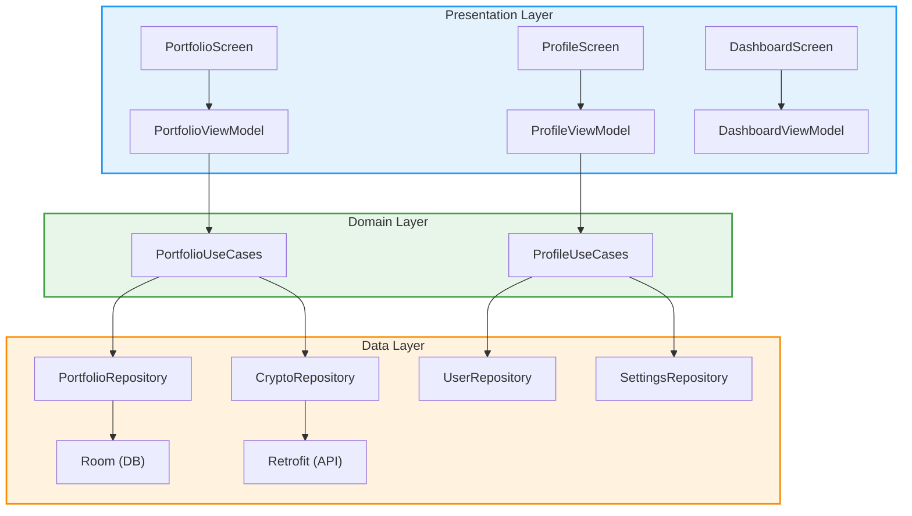

# Спецификация проекта

## Технические характеристики

### Требования к устройству

- Операционная система: **Android 10 (API 29)** и выше
- Процессор: **ARMv7, ARM64, x86, x86_64**
- Оперативная память: **от 2 ГБ**
- Свободное место на устройстве: **от 100 МБ**
- Доступ к интернету для получения актуальных данных о криптовалютах
- Разрешение экрана: **от 720x1280** (адаптивная верстка для разных размеров)

### Используемые технологии

- **Kotlin** - основной язык программирования
- **Jetpack Compose** - современный инструментарий для создания пользовательского интерфейса
- **Material 3** - дизайн-компоненты нового поколения
- **MVVM** - архитектурный паттерн
- **Clean Architecture** - принципы организации кода
- **Room** - для локального хранения данных
- **Retrofit** - для работы с сетевыми запросами
- **OkHttp** - низкоуровневый HTTP-клиент
- **Gson** - сериализация/десериализация JSON
- **Kotlin Coroutines** - асинхронное и конкурентное программирование
- **Navigation Compose** - навигация между экранами
- **Coil** - загрузка и отображение изображений
- **JUnit** - модульное тестирование
- **Mockito** - мок-объекты для unit-тестов
- **Espresso** и **Compose UI Test** - инструментальные и UI-тесты
- **Service Locator** - ручная реализация DI (Dependency Injection)
- **ViewModel** и **StateFlow** - управление состоянием и жизненным циклом

## Архитектура приложения

### Архитектурный паттерн
- **MVVM** (Model-View-ViewModel)
- **Clean Architecture** с разделением на слои:
  - **Presentation** (UI)
  - **Domain** (бизнес-логика)
  - **Data** (источники данных)

### Особенности архитектуры
- **Service Locator** используется для внедрения зависимостей (DI) между слоями.
- **StateFlow** и **ViewModel** обеспечивают реактивное управление состоянием UI.
- **Repository pattern** для абстракции источников данных (локальные и сетевые).
- **UseCase**-классы инкапсулируют бизнес-логику и используются в ViewModel.
- **UI полностью построен на Jetpack Compose** (без XML).

### Визуализация архитектуры

## Интерфейс пользователя

### Основные экраны
1. **Экран входа** - регистрация и авторизация
2. **Дашборд** - основной экран с информацией о криптовалютах
3. **Детальная информация** - подробная информация о выбранной криптовалюте
4. **Портфель** - управление личным портфелем криптовалют
5. **Профиль** - настройки профиля пользователя
6. **Поиск** - поиск криптовалют

### Навигация
- Bottom Navigation Bar для переключения между основными разделами
- Navigation Component для перехода между экранами

## Взаимодействие с внешними системами

### API
- Использование публичных API для получения данных о криптовалютах
- REST-запросы с помощью Retrofit
- JSON формат данных

### База данных
- Room для локального хранения данных
- Хранение информации о портфеле пользователя